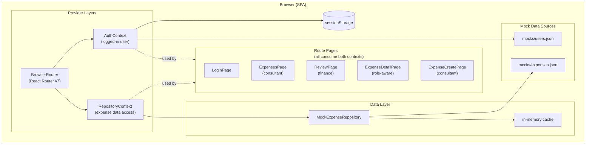

# Architecture

This document describes the architecture of Netco Expense **as it exists today**. It does not
describe planned backend, storage, or infrastructure work — see `TODO.md` for what's planned and
`docs/decisions/` for why certain choices were made.

## System Overview

Netco Expense is currently a **frontend-only single-page application (SPA)**. There is no backend
service, no database, and no network API calls. All application state lives in the browser
(React state/context + `sessionStorage`), and "data" is hardcoded mock files bundled with the
app (`src/mocks/users.json`, `src/mocks/expenses.json`).



**Provider responsibilities:**
- **`AuthContext`** — manages login state, persists user to `sessionStorage`, available app-wide via `useAuth()`
- **`RepositoryContext`** — distributes the expense data repository, available app-wide via `useRepository()`

**All route pages** (LoginPage, ExpensesPage, ReviewPage, ExpenseDetailPage, ExpenseCreatePage) consume both contexts as needed. See "Routing Architecture" and individual page sections below for specifics.

There is no server tier in this diagram because none exists. If/when a backend is introduced,
this document should be updated and a new ADR should record the API/service boundary decision.

## Frontend Architecture

The app is a standard Vite + React + TypeScript SPA rendered client-side (`src/main.tsx`). The
composition root wraps the app in, from outermost to innermost:

1. `<BrowserRouter>` (React Router v7, classic JSX API)
2. `<RepositoryProvider>` (React Context — exposes the expense data repository; see "Data Mutations")
3. `<AuthProvider>` (React Context — see "Context Usage")
4. `<App>` (route table)

There is no server-side rendering, no data-router/loader API, and no code-splitting — the app is
small enough that a single bundle and eager imports are sufficient.

## Routing Architecture

Routes are declared in `src/App.tsx` using classic `<Routes>`/`<Route>` JSX (not the v7
data-router/loader API). Route table:

| Path | Component | Access |
|---|---|---|
| `/login` | `LoginPage` | Public |
| `/expenses` | `ExpensesPage` | `consultant` role only |
| `/expenses/new` | `ExpenseCreatePage` | `consultant` role only |
| `/expenses/:id` | `ExpenseDetailPage` (role-aware) | `consultant` role only |
| `/review` | `ReviewPage` | `finance` role only |
| `/review/:id` | `ExpenseDetailPage` (role-aware) | `finance` role only |
| `/` | `RootRedirect` (inline) | Redirects to role home if logged in, else `/login` |
| `*` (catch-all) | `NotFoundPage` | Public — renders a 404 page with a "Go home" button back to `/` |

`ExpenseDetailPage` is a single **role-aware** page: it serves both `/review/:id` (finance) and
`/expenses/:id` (consultant). See "Role-aware Expense Detail Page" below.

Key principle: **there is no "return to originally requested URL" behavior.** After login, or
when a route guard rejects access, the user always lands on their role's default home
(`roleHome()` in `src/types.ts`). This is an intentional simplification, not an oversight.

Unmatched URLs (anything not in the route table above) render `NotFoundPage` instead of silently
redirecting to `/`. This is deliberate: a silent redirect makes a missing/mistyped route
indistinguishable from a normal navigation, whereas a 404 page makes the problem visible. See
`docs/decisions/architecture/0009-catch-all-404-page.md`. `NotFoundPage` is public (not wrapped in
`ProtectedRoute`) since a 404 shouldn't require login — its "Go home" button navigates to `/`,
which then applies the redirect rule above.

Route protection is implemented by a single reusable guard, not per-page checks:

- `src/components/ProtectedRoute.tsx` wraps a route's element, optionally taking
  `allowedRoles?: Role[]`.
  - No `user` → redirect to `/login`.
  - `user` present but role not in `allowedRoles` → redirect to that user's own role home
    (not to `/login`, since they are authenticated, just not authorized for this page).
  - Otherwise render `children`.

Any new protected page should be added as a `<Route>` wrapped in `<ProtectedRoute>`, not with
ad-hoc auth checks inside the page component.

## Component Structure

- `src/pages/` — route-level components (`LoginPage`, `ExpensesPage`, `ReviewPage`,
  `ExpenseDetailPage`, `ExpenseCreatePage`, `NotFoundPage`). These own page layout and compose
  shared components + shadcn primitives.
- `src/components/` — shared, hand-written components used across pages (`Header`,
  `ProtectedRoute`, `ExpenseTable`, `FilterPanel`, `ReviewDecisionForm`).
- `src/components/expenses/` — expense-domain components shared between the finance and
  consultant views (`ExpenseDetailCard`, `ExpenseReviewSection`). `ExpenseReviewSection`
  is finance-only: it owns the decidable-status logic (see ADR-0007) and renders the
  decision status message plus `ReviewDecisionForm`.
- `src/components/ui/` — shadcn/ui-generated primitives (Button, Input, Card, etc.). These are
  vendored source, not a package dependency — see `AGENTS.md` for the convention of adding new
  ones via the shadcn CLI rather than hand-writing them.

The app has a `src/components/expenses/` subfolder for expense-domain components
(`ExpenseDetailCard`, `ExpenseReviewSection`). If the app grows further (e.g., multiple domain
areas like "projects", "approvals", "reporting"), consider introducing a feature-oriented folder
structure (`src/features/`) before it becomes unmanageable. This is a decision to make
deliberately — assess actual complexity rather than adopting the pattern by convention.

## Role-aware Expense Detail Page

`ExpenseDetailPage` is a single page that serves both the finance review detail (`/review/:id`)
and the consultant expense detail (`/expenses/:id`). It determines the user's role via `useAuth()`
and renders conditionally: finance sees the review workflow (approval/rejection form), consultants
see their own expense detail (with inline edit capability when in non-terminal status). Both roles
use the same `ExpenseDetailCard` component, sharing one load path and avoiding state duplication
across separate pages. See `docs/decisions/architecture/0012-role-aware-expense-detail-page.md`.

**Consultant data-access boundary.** The consultant list (`ExpensesPage`) and detail page both
enforce a scoped data boundary: `repository.getExpensesBySubmitter(user.id)` returns only expenses
where `submitterId === user.id`. This boundary lives at the repository layer (not the UI), so it
will carry over to a real backend. After loading a detail page, the page verifies the expense
belongs to the current user; a mismatch returns 404 (same as unknown ID, to avoid leaking existence).
This is a **UX boundary only** — the true authorization boundary must be enforced server-side once
a backend exists. See `docs/decisions/architecture/0010-mock-repository-pattern.md`.

## State Management

There is no external state management library (no Redux, Zustand, Jotai, etc.), and no server
state library (no React Query/SWR) — because there is no server to fetch from.

State lives in two places today:

1. **Local component state** (`useState`) for ephemeral, page-local concerns (e.g. `LoginPage`'s
   `loginError`, react-hook-form's internal form state, expense list and filter criteria on
   `ReviewPage`).
2. **`AuthContext`** for the one piece of *state* that is genuinely cross-cutting: the logged-in
   user.

The app's other context, `RepositoryContext`, is not state management — it distributes the
expense data repository (a service object, not mutable UI state) to components. See
"Data Mutations" under "API / Service Boundaries".

**In-memory filtering:** `ReviewPage` loads all expenses from the repository on mount into local 
state. Filtering is implemented as a pure function (`filterExpenses()`) that returns a new filtered
array without mutating the original. The full dataset stays in memory; clearing filters resets
the filter criteria, not the data. See `docs/decisions/0005-in-memory-filtering-pattern.md`.

Given the app's current size, plain Context is sufficient. If more cross-cutting state is added
in the future (e.g. a shared expenses list consumed by both `ExpensesPage` and `ReviewPage`),
re-evaluate whether Context is still appropriate before reflexively adding another provider — see
`docs/decisions/0001-auth-state-via-react-context.md`.

## Data Model

The expense data model is defined in **JSON Schema Draft 2020-12** in `src/schemas/expense.schema.json`. TypeScript interfaces (`Expense`, `ExpenseType`, `ExpenseStatus`) in `src/types.ts` are derived from the schema. A Markdown summary is maintained in `docs/data-models/expense.md` for reference.

The JSON Schema in `src/schemas/` is the authoritative source of truth.

**Runtime Validation:** Validation happens at **write boundaries**, not at load time. The frontend must be resilient to invalid data from the backend (real or mock), just as it would if a database contained corrupted records or incomplete migrations.

- Mock data is loaded **without validation** from `src/mocks/expenses.json` into the repository's in-memory cache.
- Read operations may encounter invalid data and must handle it gracefully (e.g., component error boundaries, defensive checks).
- Write operations (form submissions, mutations) validate data **before persisting** via `src/lib/expense-validation.ts` (using `ajv`). The validation functions are:
  - `validateAndParseExpense(data)` — validates and returns typed `Expense`, or throws with details (used on write operations)
  - `isValidExpense(data)` — type guard that checks without throwing (used for read-time defensive checks)

This design ensures the app boots even with invalid mock or backend data, mirrors real-world backend scenarios, and establishes clear validation boundaries.

See `docs/decisions/0004-expense-data-model-json-schema.md` for rationale and consequences.

## Context Usage

The app has two contexts with different jobs:

- **`AuthContext`** (`src/context/AuthContext.tsx`) — shared *state*: the logged-in user.
- **`RepositoryContext`** (`src/context/RepositoryContext.tsx`) — shared *service*: the expense
  data repository. It holds no state of its own; it just makes the `mockRepository` singleton
  available to components via `useRepository()`. See "Data Mutations" under "API / Service
  Boundaries" for the full picture.

`AuthContext` exposes:

```ts
{ user: User | null; login(email, password): { success, error?, user? }; logout(): void }
```

Behavior:

- On mount, hydrates `user` from `sessionStorage` (key `netco-expense-auth`) if present, so a
  page refresh doesn't log the user out.
- `login()` checks credentials against the hardcoded array in `src/mocks/users.json`
  (case-insensitive email, exact password match) and, on success, stores the user
  (**without the password field**) in both React state and `sessionStorage`.
  `logout()` clears both.
- `useAuth()` is the only way to read or mutate auth state; it throws if used outside
  `AuthProvider`, which fails fast on misuse rather than silently returning `undefined`.

This is explicitly mock authentication for a frontend-only demo — see
`docs/decisions/0002-mock-json-authentication-boundary.md` and `TODO.md` (Blocking Go-Live) for
the plan to replace it with real backend auth.

## Form / Validation Architecture

Forms use `react-hook-form` for form state/registration and `zod` for schema validation, wired
together via `@hookform/resolvers/zod`. The app has three forms:

- **`LoginPage`** — the login form. Its zod schema defines both field-level constraints and their
  user-facing error messages, which are deliberately generic ("Invalid email or password") for
  both the email and password fields and for a failed credential match — the schema doesn't
  reveal whether an email was malformed or simply didn't match, avoiding leaking which part of a
  login attempt was wrong. Submission calls `AuthContext.login()`; a failure path (bad
  credentials) is surfaced via a shadcn `Alert`, separate from field-level errors (which come
  from zod/react-hook-form).
- **`ReviewDecisionForm`** (hosted by `ExpenseReviewSection`) — the finance decision form
  (approve / request changes with a comment). See ADR-0008.
- **`ExpenseDetailCard`** — the expense detail form. Its seven consultant-editable fields are
  validated by the shared `expenseSchema` (Zod) in `src/schemas/expense.ts`; the form validates
  on blur and shows inline field errors. The fields are disabled unless the card's `isEditable`
  prop is true (see ADR-0013). When `isEditable` and an `onResubmit` callback are both supplied,
  a submit button submits the form: the card calls `onResubmit` with the form values plus the
  expense's `id` and renders the loading/success/error feedback itself, while the page performs
  the `repository.updateExpense()` mutation (see ADR-0014). The button label is customizable via
   the optional `buttonLabel` prop (default `'Resubmit'`; the loading label and the
   success/error feedback messages are derived from it — e.g. `'Submit'` →
   `'Submitting…'` / "Expense submitted successfully." / "Failed to submit…", while the
   default `'Resubmit'` → `'Resubmitting…'` / "Expense resubmitted successfully." /
   "Failed to resubmit…"), so the same card serves both the edit flow
   (`ExpenseDetailPage`) and the create flow (`ExpenseCreatePage`, `buttonLabel="Submit"`).
   In the create flow the page's `onResubmit` callback calls `repository.createExpense()`
   (which preserves the `Submitted` status, unlike `updateExpense`'s `Resubmitted` transition)
   and then navigates to `/expenses/{id}` after a short delay so the inline success message is
   visible; on rejection the card keeps the form data intact for retry.

All forms follow the same pattern: zod schema → `useForm({ resolver: zodResolver(...) })` →
shadcn `Input`/`Label` bound via `register()` or `Controller` → submit handler calling into the
relevant context/service.

## API / Service Boundaries

### Authentication

`AuthContext` currently owns the one piece of "data access" the app had before the finance review workflow: reading and validating credentials from `mocks/users.json`. This is intentionally mock and is tracked for replacement in `TODO.md` (Blocking Go-Live tier).

### Data Mutations (Finance Review Workflow)

Data mutations (e.g. approving an expense, requesting changes) never happen directly in a
component. They go through a **repository** — a small object that owns all reads and writes of
expense data. A component asks the repository to change something and uses the result it gets
back; it never edits the underlying data itself.

The three pieces:

- **Interface:** `src/lib/repositories/ExpenseRepository.ts` — the contract any implementation
  must fulfil: `getExpense(id)`, `getExpenses()`, `getExpensesBySubmitter(submitterId)`,
  `createExpense(expense)`, `updateExpenseStatus(id, status, comment?)`, and
  `updateExpense(id, updates)`. All return Promises, so call sites are already shaped like
  they're talking to a network API.
  `getExpensesBySubmitter(submitterId)` is the consultant-scoped read: it returns only expenses
  whose `submitterId` matches, establishing the data-access boundary for consultant queries (it
  will enforce authorization server-side once a real backend is introduced).
  `updateExpense(id, updates)` merges partial form updates with the stored expense, validates the
  merged object against the full schema, transitions the status to `Resubmitted`, and rejects
  `Approved` expenses (see ADR-0013).
- **Mock implementation:** `src/lib/repositories/MockExpenseRepository.ts` — keeps a copy of the
  mock expenses in an in-memory `Map`. `getExpenses()` returns all stored expenses (reflecting any
  prior mutations). `createExpense(expense)` validates a complete expense against the schema,
  rejects duplicate IDs and `Approved` (terminal) statuses, then stores a **new** object.
  `updateExpenseStatus` and `updateExpense` replace the stored expense with a
  **new** object (the original is never mutated) and return it. `reset(expenses)` re-seeds the
  map; tests use it to start from a clean state.
- **Provider:** `src/context/RepositoryContext.tsx` — makes one repository instance available to
  every component in the app (see below for how).

**How components get the repository (React Context, briefly).** React Context is a built-in way
to make one value available to any component in the tree without passing it through props, layer
by layer. A `<Provider>` near the top of the tree holds the value; any component below it
retrieves it with a hook:

```tsx
// src/context/RepositoryContext.tsx (simplified)
<RepositoryContext.Provider value={repository}>{children}</RepositoryContext.Provider>

// any component rendered below the provider:
const repo = useRepository()
```

`RepositoryProvider` is mounted once in `src/main.tsx` (see the composition root above), so
`useRepository()` works in any page or component. It throws a descriptive error if called outside
the provider, so a missing provider fails loudly instead of silently returning `undefined`.

**Where the data comes from.** On startup, `RepositoryContext.tsx` creates a single
`MockExpenseRepository` (the exported `mockRepository` singleton) seeded with a **copy** of
`src/mocks/expenses.json` (loaded and validated by `src/mocks/expenses.ts`). The copy matters:
mutations happen on the repository's in-memory data, so the original mock module — and any
component that reads it directly — is never affected.

**Usage pattern in a component:**

```typescript
const repo = useRepository()
const updated = await repo.updateExpenseStatus(id, status, comment)
setExpense(updated)
```

The component stores the returned expense in local state — the repository is the source of truth
for what was saved, and the component just displays what it got back.

**Swapping in a real backend.** Implement the same `ExpenseRepository` interface as an API client
(HTTP calls to a backend), then pass it to `<RepositoryProvider repository={apiRepo}>` in
`src/main.tsx`. Nothing else changes: components only know the interface, never the
implementation. See `docs/decisions/architecture/0010-mock-repository-pattern.md` for the full
rationale.

### Reads vs. Writes

- **Reads** — both the expense *list* (`ReviewPage`) and the expense *detail* page 
  (`ExpenseDetailPage`) load their expenses through the repository on mount via `getExpense()` 
  and `getExpenses()` respectively. This ensures the list always shows the latest state (including
  any mutations made on the detail page) when navigating back. See ADR-0011.
- **Writes** (e.g., approving an expense) flow through the repository so mutations are
  isolated in memory and reversible in tests.

## Data Flow

1. User submits the login form → `LoginPage` validates via zod → calls `AuthContext.login()`.
2. `AuthContext` matches credentials against `mocks/users.json`, updates its internal `user`
   state, and persists it to `sessionStorage`.
3. Any component that calls `useAuth()` (e.g. `Header`, `ProtectedRoute`, `App`'s
   `RootRedirect`) re-renders with the new `user` value on the next React render triggered by
   the context update.
4. Route guards (`ProtectedRoute`) read `user` on every render to decide whether to render the
   protected page or redirect.

There is no caching layer, no background sync, and no optimistic updates — state changes are
synchronous and local to the browser tab.

## Testing Architecture

Three distinct layers, each with a different purpose (see
`docs/decisions/0003-two-layer-testing-strategy.md`):

- **Vitest + React Testing Library** (`src/App.test.tsx`, colocated `.test.tsx` files) —
  integration-style tests that render the real `App` component tree (routes, context, guards)
  inside a `MemoryRouter`, and drive it through user-facing interactions (typing, clicking) rather
  than calling internal functions directly. This is the primary place login/routing/auth logic is
  verified. Run via `npm run test`.
- **Storybook** (`.stories.tsx` files) — Visual component development and manual testing. Renders
  individual components in isolation with different prop combinations. Run via `npm run storybook`.
  Useful for QA visual verification before integration and for exploring component behavior
  interactively.
- **Playwright** (`e2e/`) — full-browser end-to-end tests that exercise the app the way a real
  user would, through an actual dev server. These validate things RTL/jsdom can't (real
  navigation, real rendering), at the cost of being slower. Run via `npm run test:e2e` (headless)
  or `npm run test:e2e:headed` (visible browser). Use `PLAYWRIGHT_SLOW_MO=<ms>` to slow down
  actions for visual debugging, e.g. (PowerShell) `$env:PLAYWRIGHT_SLOW_MO=800; npm run test:e2e:headed`.
  When a test fails, Playwright captures a screenshot of the page at the moment of failure plus an
  `error-context.md` snapshot of the page state and writes them to
  `test-results/<test-name>-chromium/` (configured via `screenshot: 'only-on-failure'` in
  `playwright.config.ts`); traces are recorded only on retry (`trace: 'on-first-retry'`).

E2E tests cover both workflows. Finance: login → All Expenses → filter → view detail →
approve/request changes → verify status update (`review-*.spec.ts`). Consultant: login →
own-expenses list (scoped, submitter filter hidden) → status/type/date filters → view read-only
detail → back → and an ownership-mismatch 404 when a consultant opens an expense they did not
submit (`expenses-consultant.spec.ts`, `login-consultant.spec.ts`). Consultant editing:
edit + resubmit a `Submitted` expense (status → `Resubmitted`, list reflects the update),
address finance feedback on a `Changes Requested` expense, re-edit a `Resubmitted` expense
before finance re-reviews, `Approved` immutability (disabled fields, no Resubmit button),
error recovery from an invalid resubmission (inline validation error, corrected retry), and
the full cycle where finance approves a `Resubmitted` expense and the consultant's subsequent
visit is read-only (`expenses-consultant-edit.spec.ts`). Consultant creation: login →
"New Expense" button on the list → `/expenses/new` (template defaults: today's date, USD,
amount 0, `Breakfast`, `Submitted`) → fill required fields → Submit → success message →
redirect to the new expense's detail page; plus error recovery from an invalid (empty/zero)
amount (inline validation error, form data persists, corrected retry), an unauthenticated
redirect to `/login`, and a finance redirect to `/review` when accessing `/expenses/new`
(`add-expense.spec.ts`). The repository-failure error path is deliberately not covered in E2E:
`MockExpenseRepository.createExpense()` has no user-triggerable failure in the create flow, so
simulating one would require a test-only seam in production code (rejected — see the scope
decision in `plans/add-new-expense/tickets/04-e2e-tests-full-workflow.md`). Repository
failure/retry is covered at the RTL layer in `src/pages/ExpenseCreatePage.test.tsx` (injected
mock repository), per the testing-architecture boundary above. Shared helpers live in
`e2e/helpers.ts`: `loginAs` (full-load login), `loginAsSpa` (login without a full page load,
so the in-memory repository state survives a logout → login cycle), `statusBadge` (the
detail-page status badge, scoped to the badge element so it never matches the "Submitted"
field label or the header's role badge) and `expectDetailPageLoaded` (waits for the
"Expense Details" card to render before a status assertion — React Router updates the URL via
pushState before it re-renders the route, so the list page's badges may still be in the DOM in
between and an unscoped text locator would hit a strict-mode violation).

There are currently no isolated unit tests for individual functions (e.g. `roleHome()`) — coverage
is achieved through the integration-style tests above, which was a deliberate choice given the
app's current size, not an oversight.

## Architectural Boundaries and Principles

- **Auth state has exactly one owner:** `AuthContext`. No component reads `sessionStorage`
  directly or duplicates auth logic.
- **Route access control lives in one place:** `ProtectedRoute`. Pages do not implement their own
  redirect-if-unauthorized logic.
- **Role-aware rendering lives in the page, not the guard:** `ProtectedRoute` decides which role
  may enter a route; the page (e.g. `ExpenseDetailPage`) decides what that role sees. Ownership
  checks for scoped resources (consultant → own expenses only) live at the page level and fail
  closed to the 404. See ADR-0012.
- **shadcn `ui/` components are vendored, not authored:** don't hand-edit generated primitives
  beyond their `cva` variant config; see `AGENTS.md` styling rules.
- **No premature abstraction:** there is no service layer, no state management library, and no
  feature-folder structure, because the current app doesn't need them yet. Introduce these
  deliberately, with a documented reason (ideally an ADR), rather than by convention or habit.
- **Mock data is explicitly temporary:** anything reading `src/mocks/` is expected to be replaced
  when a real backend exists (tracked in `TODO.md`, Blocking Go-Live tier).
- **Expense data model is schema-first:** `docs/data-models/expense.schema.json` is the
  authoritative source; TypeScript interfaces are derived from it. See ADR-0004.
- **Filtering is pure and in-memory:** `filterExpenses()` is a pure function; the full dataset
  stays in component state. See ADR-0005.
- **Status workflow is a state machine:** Four statuses (Submitted, Approved, Changes Requested,
  Resubmitted) with defined transitions. See ADR-0007.
